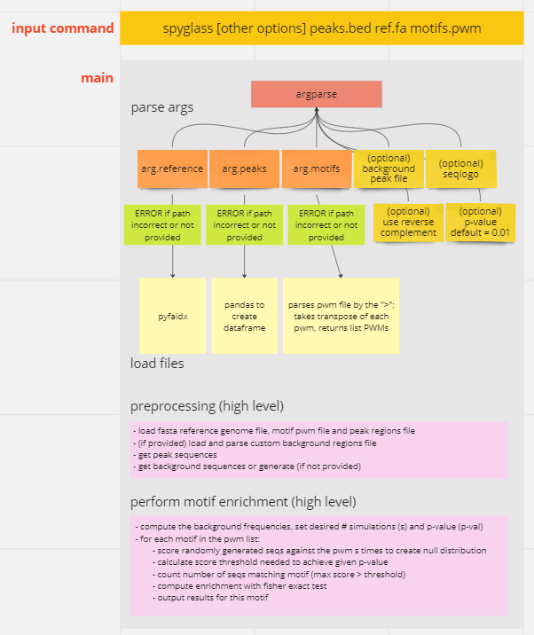
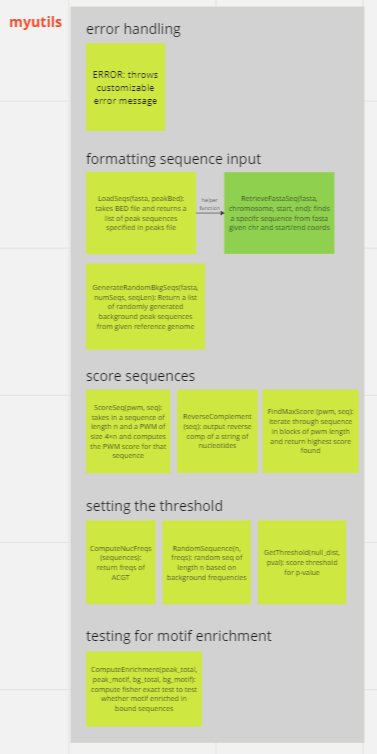

# spyglass
 <br clear="left"/> `spyglass` is a Python package that detects the enrichment of known DNA-binding motifs in genomic regions. This PWM (position weight matrix)-based implementation performs a subset of the `findMotifsGenome.pl` command available through Homer (see the [Homer](http://homer.ucsd.edu/homer/ngs/peakMotifs.html) page for more details).

[Prerequisites](#prerequisites) | [Installation](#install) | [Basic Usage](#usage) | [spyglass Options](#options) | [File formats](#formats) | [Testing](#testing)

<a name="prerequisites"></a>
## Prerequisites
`spyglass` requires the following python libraries to be installed:
- numpy
- pandas
- pyfaidx
- scipy
- seqlogo

These packages can be installed with `pip`:
```
pip install numpy pandas pyfaidx scipy seqlogo
```
Note: If you do not have root access, you can run the command above with additional options to install locally:
```
pip install --user numpy pandas pyfaidx scipy seqlogo
```

<a name="install"></a>
## Installation
Once required libraries are installed (please see [Prerequisites](#prerequisites)), please install `spyglass` with the following commands:
```
git clone https://github.com/kyrafetter/spyglass.git
cd spyglass
python setup.py install
```
Note: if you do not have root access, you can run the command above with additional options to install locally:
```
python setup.py install --user
```
If the install was successful, type `spyglass --help` to show a useful message. 

Note: If the spyglass command was not found, you may need to include the script installation path in your `$PATH` before calling spyglass. You can use `export PATH=$PATH:/home/<user>/.local/bin` to do so. 

<a name="usage"></a>
## Basic Usage 
The basic usage of `spyglass` is:
```
spyglass [other options] peaks.bed ref.fa motifs.pwm
```
### Testing `spyglass`: Mini Files
To run `spyglass` on our mini test files (see `example_files`):
#### Using User-Provided Background
```
spyglass example_files/test_peaks.bed example_files/test_ref.fa example_files/test_motifs.pwm -b example_files/test_background.bed
```
This should produce the output below:
```
# motif_name    motif_occurences_foreground     motif_occurences_background     pvalue  enriched?
E2F5_HUMAN.H11MO.0.B    9/10    1/10    1.093e-03   no
FOXK1_HUMAN.H11MO.0.A   0/10    0/10    1.000e+00     no
GATA2_HUMAN.H11MO.0.A   0/10    0/10    1.000e+00     no
```
#### Using Random Background 
Note: the number of motif occurences in background sequences, p-values, and enrichment status may not exactly match our sample output below as the background is randomly generated
```
spyglass example_files/test_peaks.bed example_files/test_ref.fa example_files/test_motifs.pwm
```
This should produce a similar output to the one below:
```
# motif_name    motif_occurences_foreground     motif_occurences_background     pvalue  enriched?
E2F5_HUMAN.H11MO.0.B    9/10    2/10    1.977e-02    no
FOXK1_HUMAN.H11MO.0.A   0/10    0/10    1.000e+00     no
GATA2_HUMAN.H11MO.0.A   0/10    0/10    1.000e+00     no
```
### Testing Homer: Mini Files
To compare to output of [Homer](http://homer.ucsd.edu/homer/ngs/peakMotifs.html) `findMotifsGenome.pl`, run:
```
findMotifsGenome.pl example_files/test_peaks.bed example_files/test_ref.fa homer_results -mask -size given -mknown example_files/test_homer.motifs -nomotif
```
<a name="options"></a>
## spyglass Options
`spyglass` has the following required arguments (please see [File Formats](#formats) for file specifications):
- `peaks.bed`: BED file of genomic peak regions (this will commonly be peak calls from ChIP-seq datasets)
- `ref.fa`: faidx indexed reference sequence in Fasta format
- `motifs.pwm`: PWM file of motif PWMs of interest. `spyglass` will determine whether these motifs are significantly enriched in `peaks.bed`

Additionally, users may choose to specify the optional options below:
 - `-h`, `--help`: show help message and exit
 -  `-o DIRECTORY`, `--output DIRECTORY`: write output to directory. Default: working directory
 - `-l FILE`, `--log FILE`: write log to file. Default: stdout
 - `-b BACKGROUND`, `--background BACKGROUND`: BED file of user-specified background genomic peak regions. Default: background sequences are randomly chosen from the reference genome
 - `-p PVAL`, `--pval PVAL`: p-value threshold for significant enrichment. Default: 0.0000001 
 - `-nr`, `--not-reverse`: do not consider reverse complement in enrichment analysis. Default: False
 - `-s SEQLOGO`, `--seqlogo SEQLOGO`: generate motif logo of enriched motifs. Default: True
 - `--version VERSION`: print the version and quit. 

<a name="formats"></a>
## File Formats
### Input Files
#### `peaks.bed` 
A tab-delimited file in BED format with no header. It contains 6 columns as follows:
```
chromosome    start_coordinate    end_coordinate    peak_ID    .    strand(+/-)
```
 - col 1: chromosome, in the format `chr[name]` where `[name]` is the chromosome number 
 - col 2: start coordinate, the start of the peak region
 - col 3: end coordinate, the end of the peak region
 - col 4: peak ID, string ID for given peak
 - col 5: not used
 - col 6: strand, either `+` for the forward strand or `-` for the reverse strand

#### `ref.fa` 
A reference genome sequence in FASTA format. It contains the name of the chromosome followed by the sequence:
```
>chr[name]
[chromosome sequence]
```
#### `motifs.pwm` 
The PWMs of motifs-of-interest. It contains the name of motif followed by a 4 tab-delimited columns of weights (using alphabetical order of
nucleotides, ACGT), one row per motif position:
```
>[motif name]
weight_A    weight_C    weight_G    weight_T
```
### Output Files
#### `spyglass_results.txt`
The final output file, contains the following tab-delimited columns:
```
motif_name    number_foreground_peaks_with_motif    number_background_peaks_with_motif    p-value    enriched(yes/no)
```
The list of motifs will be sorted so that enriched motifs are listed first and by p-value significance (smallest to largest). 

<a name="testing"></a>
## Testing

<a name="Miro Board"></a>
## Miro Board
We used [miro](https://miro.com/app/live-embed/uXjVMB4LARw=/?embedMode=view_only_without_ui) to help wireframe our design process <br/>




<a name="contributors"></a>
## Contributors 
This repository was generated by Michael Chan, Kyra Fetter, and Jessica Wang. We credit [`mypileup (CSE185 Project Demo)`](https://github.com/gymreklab/cse185-demo-project) for inspiration and direction.

Please submit a pull request with any corrections or suggestions. Thanks!
